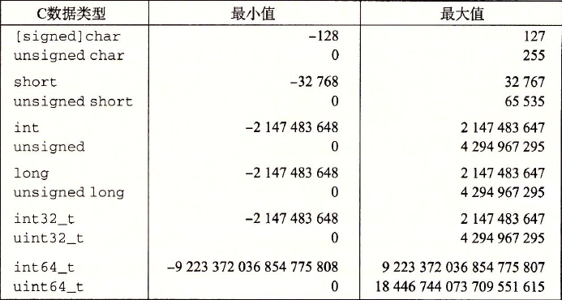

# Charpter2 Note

**1.字(word)的表示和存储**

小端法机器永远是最低有效位先输出，例：```0x00003039```，先输出 ```0x39```。参考程序1.1。

位级运算的常见用法是**掩码运算**。掩码表示从一个字中选出位的集合。例：```x=0x89ABCDEF```，位运算```x&0xFF```得到表达式```0x000000EF```。32位机器可写掩码为0xFFFFFFFF，但这样不可移植。

**程序：**
1.1 十六进制输出int、float、pointer：[show_bytes](./show_bytes.c)
```
/*
test result:
    print 12345:
        print int: 39 30 00 00
        print float: 00 e4 40 46
        print pointer: 90 fe 61 00
        print 12345 in ASCII: 31 32 33 34 35 00
    练习题2.5:
        21
        21 43
        21 43 65
    练习题2.7:
        print string: 61 62 63 64 65 66
*/
```
使用ASCII码作为字符码输出结果与字节顺序和字大小规则无关。


**2.整数表示**
下图为32位机器上整型数据类型范围：


