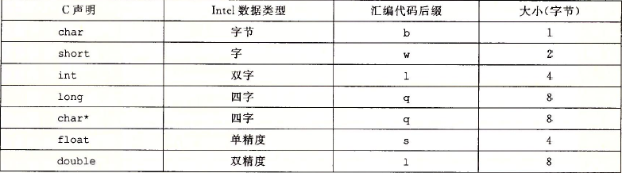
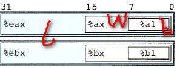

# Chapter3 Note

**1.汇编及二进制文件测试**

主要内容参考程序1.1

**程序：**

1.1 代码内容：[code](./code.c)

**2.数据格式**

以下为c语言中x86-64的数据类型大小。

大多数常用数据类型是以双字存储。

**3.数据访问**

操作数(operand)分为三种类型：
一是立即数，也就是常数值。
二是寄存器，表示寄存器内容。
三是存储器引用，根据计算出来的地址访问某个存储位置。

**4.MOV指令**

MOV指令类中 b代表传字节，w代表传字，l代表传双字。
如下图中所代表的各指令操作数的大小。

